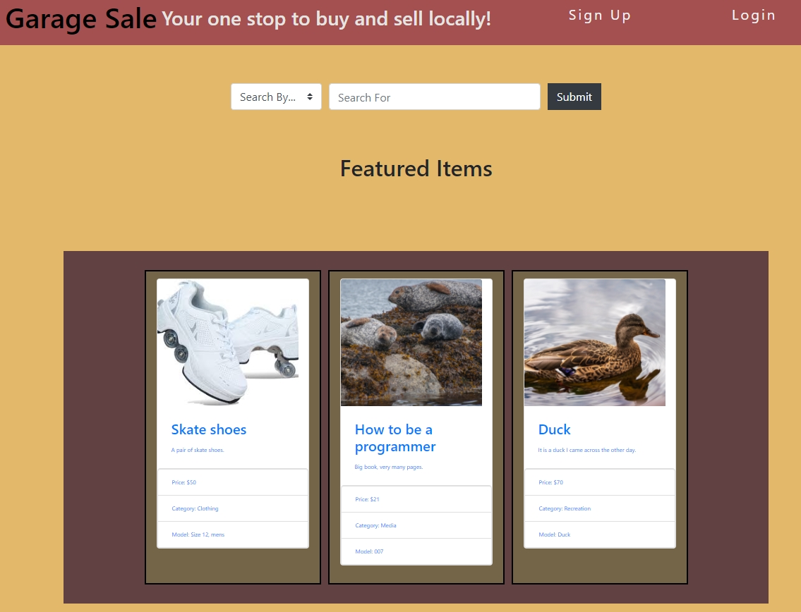
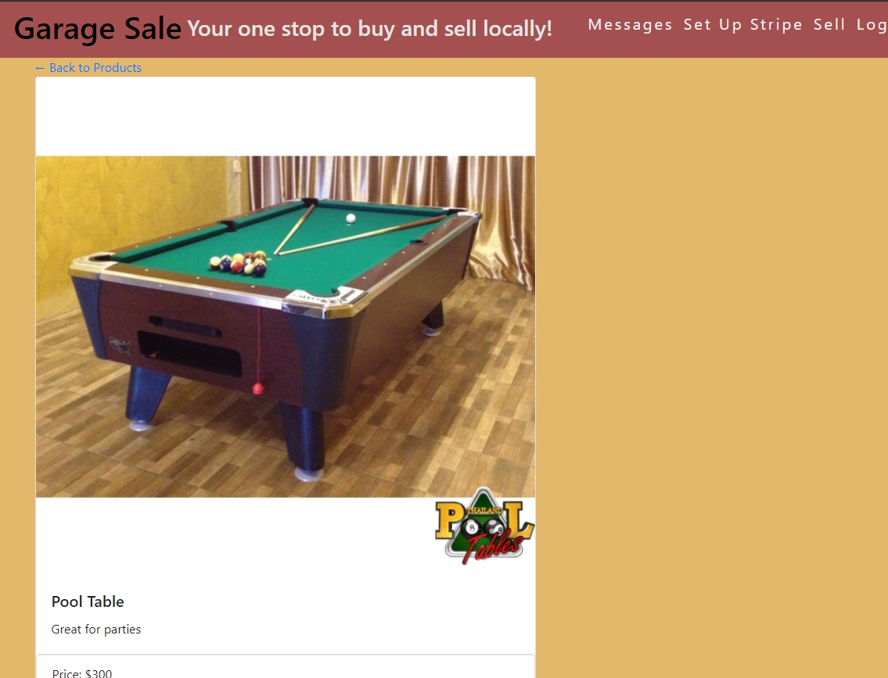
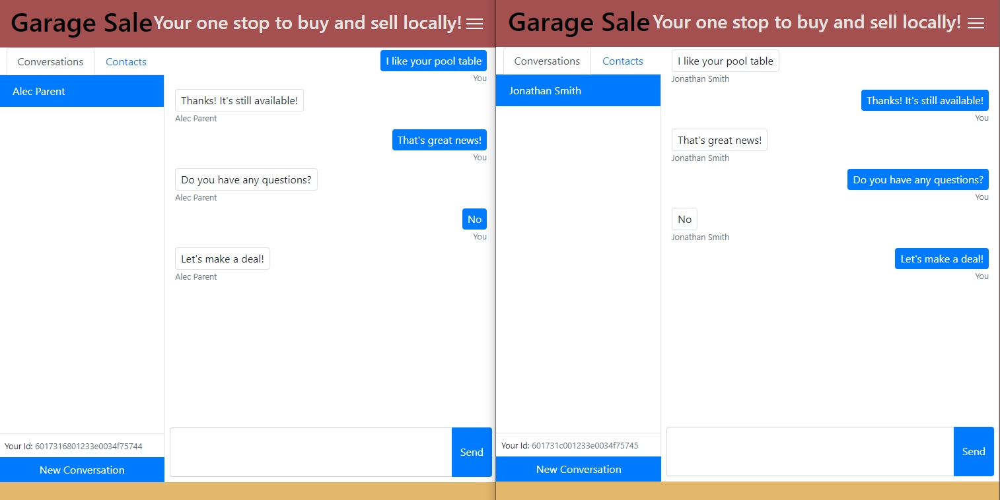

# Garage Sale

> Garage Sale is a website that allows users to securely and safely sell locally to other users.

## Table of contents

- [User Stories](#user-stories)
  - [Unauthenticated Users](#unauthenticated-users)
  - [Sellers](#sellers)
  - [Buyers](#buyers)
- [Screenshots](#screenshots)
- [Technologies](#technologies)
- [Setup](#setup)
  - [Installation](#installation)
  - [Environment Variables](#environment-variables)
  - [Initial Login](#initial-login)
- [Features](#features)
- [Inspiration](#inspiration)
- [Deployed Application](#deployed-application)
- [Contact](#contact)

## User Stories

During the pandemic, folks who want to supplement their income want to sell items without paying high shipping costs or putting themselves at risk by interacting with strangers. Sellers don’t want to waste their time with potential buyers who promise to buy an item and never show up, forcing them to re-list their item. Sellers also don’t want to be bothered by other buyers once a sale has been started. Buyers and sellers want to both be safe during a transaction and avoid being assaulted or robbed.

### Unauthenticated Users

As an unauthenticated user

- I must be able to login to the application: I must be provided with a login screen which asks for email and password. If I successfully login, I must be taken to my dashboard. If I do not successfully login, I must be given an error.
- I must be able to sign up for the site: I must be provided with a sign up page which asks for username, password and email. If I successfully create a new user, I must be taken to my dashboard. If I attempt to use an invalid or duplicate email, I must be given an error.
- I must be able to see the items listed for sale: Whether I am logged in or not, I must be able to reach the landing page. This page must list the top 3 items for sale in most recent order.
- I must be allowed to search for specific items: I must have a search box at the top of the page that will allow me to do a specific search for the item I am looking for. If there are matching items, they must be displayed. If there are no matching items, I must be given a notification.

### Sellers

As an authenticated user looking to sell an item:

- I must be able to add an item for sale: If I have successfully authenticated, I must be able to have an option to add an item to the garage sale. This must include a screen that allows for a title, description, price, and image. Once I have created the item, I must be allowed to submit the item.
- I must be able to add an image to an item for sale: On the item creation screen, I must be able to add an image to the item which can be displayed on the items for sale pages.
- I must be able to receive messages from interested buyers on the Web site that I can see when I log in.
- Once the item has been passed to the buyer, I must receive the funds: Once the sale has successfully been completed, the funds must be taken out of escrow and sent to me, minus the site’s commission.
- If an item has been sold, I must no longer see it on the page for sale: Once an item has been purchased, it must be removed from the site, so that there are no duplicate purchase attempts. Purchased is not the same as put into escrow.

### Buyers

As an authenticated user looking to buy an item:

- I must be able to see a detail screen for an item: If I click on an image on the main page, I must be taken to a detail screen for that item. It must provide the detailed information for that item that will enable me to decide if I wish to purchase it.
- I must be able to select to purchase an item from the detail page: If I am an authenticated user, I must be able to select to purchase an item from the detail page.
- When I have purchased an item, I must not be charged until I am ready: the funds must be held in escrow or placed on hold until I have received the item, and agreed to its value.
- I must be able to set up a meeting with the seller and an emergency contact that will be messaged if I do not check in at a predetermined time.
- I must be able to cancel alerts so my emergency contact is not accidentally messaged.

## Screenshots






## Technologies

- MongoDB
- Nongoose
- nodeJS
- express
- nodemailer
- gmail SMTP Server
- bcrypt
- PWA
- Stripe
- Bootstrap

## Setup

### Installation

- Run 'npm install' from the command line to install required packages
- Run 'npm run seed' to seed the database with categories
- Run 'npm start' from the command line to create the tables in the database

### Environment Variables

```
**Stripe**
STRIPE_PUBLISHABLE_KEY="[Stripe Key]"
STRIPE_SECRET_KEY="[Stripe Secret Key]"
STRIPE_WEBHOOK_SECRET="[Stipe Webhook Secret]"


# Email notification
NOTIFY_EMAIL_ADDR='garagesalealerts@gmail.com'
NOTIFY_EMAIL_PW='Fr3nchFr13s'
NOTIFY_EMAIL_SERVICE='gmail'
```

### Initial Login

Set up a new user with the Sign Up link on the navigation bar.

## Features

- A secure and safe way to buy and sell items locally
- Sellers can post information and a picture of the item for sale
- Buyers can search for items on the Web site
- Buyers and sellers can contact each other through a native messaging system
- Funds can be held in escrow until the transaction is complete, allowing for touchless exchange of items
- Buyers can set up information about their meeting to alert an emergency contact if they don’t check in within a certain period of time
- Buyers and Sellers can post reviews of one another that other users can use to determine if they want to do business with that person
- Application is available as a PWA

To-do list:

- Establish an administrator profile to handle disputes and check emergency alerts
- Establish a dispute process

## Inspiration

Project inspired by issues encountered in real world when selling items during the pandemic as well as physical threats to online shoppers such as the Craigslist Killer, Philip Markoff. Based on project work in the University of Utah Web Coding Bootcamp such as Shop Shop.

## Deployed Application

Deployed Application: [Garage Sale](https://garage-sale-project.herokuapp.com/)

## Contact

Created by [Asher Clawson](https://github.com/KingPogona), [Jani Muhlestein](https://github.com/janimuhlestein), [Jesse Parent](https://github.com/jesseparent), [Jeremy Cornwall](https://github.com/cornwalljeremy)
